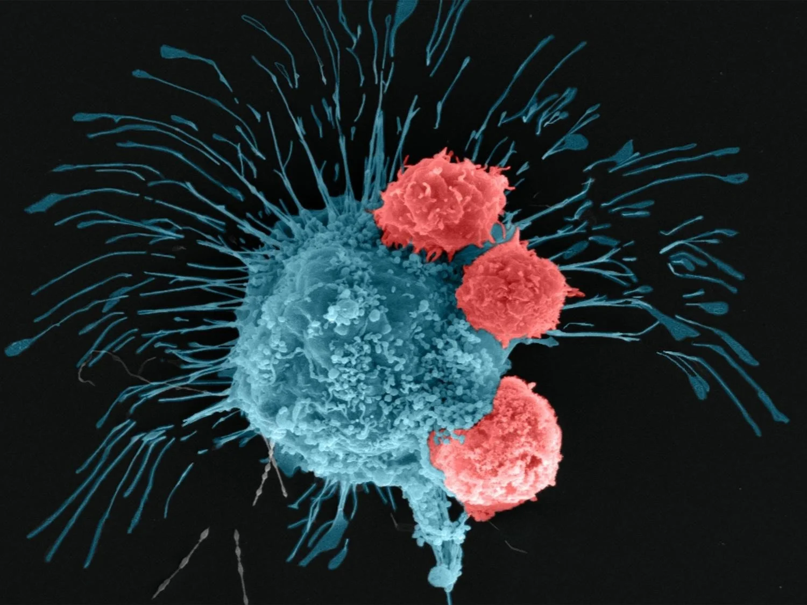
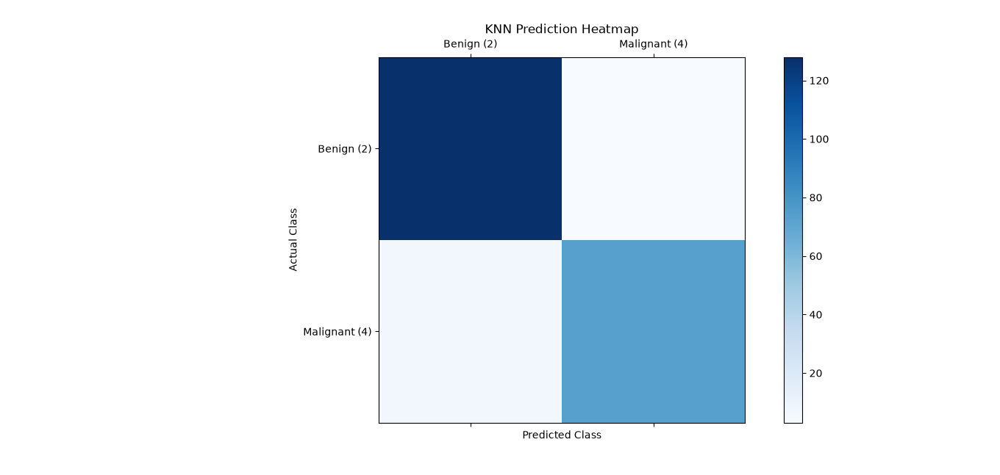

🩺 Breast Cancer Diagnosis — KNN From Scratch
A custom-built K-Nearest Neighbors classification engine that diagnoses breast tumors as Benign or Malignant, benchmarked against Scikit-Learn's built-in implementation.

This project demystifies the "black box" of machine learning by building the KNN algorithm entirely from scratch using fundamental Euclidean distance mathematics. Rather than relying on external libraries, the core classification engine is hand-coded to prove a practical understanding of how distance-based algorithms work under the hood.

This is part of an ongoing initiative to build end-to-end machine learning applications through iterative development, with a focus on modular code architecture, OOP principles, and custom algorithm engineering.

🚀 Key Objectives
Algorithmic Transparency: Build a custom KNN classification engine from scratch to understand distance metrics, sorting, and majority voting without relying on external ML libraries.

Performance Benchmarking: Compare the training and testing accuracy of the custom engine directly against Scikit-Learn's KNeighborsClassifier.

Modular Engineering: Separate data preprocessing, model architecture, and visualization into distinct, reusable Python modules.

Visual Evaluation: Generate confusion matrix heatmaps using Matplotlib to evaluate classification performance.

🛠 Tech Stack
Category	Tools
Core	Python, NumPy, Pandas
ML	Scikit-Learn (MinMaxScaler, train_test_split, KNeighborsClassifier, metrics)
Visualization	Matplotlib
Architecture	Object-Oriented Programming, Modular Python Scripts
📁 Folder Structure
Plaintext
Breast_Cancer_Diagnosis/
│
├── Data/
│   └── breast_cancer.csv            # Wisconsin Breast Cancer Dataset (699 samples)
├── Model/
│   ├── __init__.py
│   └── knn_classification.py        # Custom KNN engine built from scratch
├── Preprocess/
│   ├── __init__.py
│   └── Preprocessing.py             # Data loading, cleaning, and MinMax scaling
├── Visualization/
│   ├── __init__.py
│   └── Visuals.py                   # Confusion matrix heatmap generation
├── Visuals/
│   ├── bim.png                      # Header image
│   ├── Figure_1.png                 # Confusion matrix heatmap output
│   └── Screenshot 2026-08-08...     # Terminal output screenshot
├── main.py                          # Main execution script
├── model.pkl                        # Serialized trained model
├── requirements.txt                 # Project dependencies
└── README.md                        # This file
📊 How It Works
The KNN Algorithm (Custom Implementation)

Store — During training, KNN simply memorizes all the training data points.

Calculate — For a new sample, compute the Squared Euclidean Distance to every training point.

Sort — Sort all distances from smallest to largest.

Vote — Pick the k nearest neighbors (k=5) and count their class labels.

Decide — The class with the most votes wins (majority voting).

Features Used (9 Cell Measurements)

#	Feature	Range
1	Clump Thickness	1–10
2	Uniformity of Cell Size	1–10
3	Uniformity of Cell Shape	1–10
4	Marginal Adhesion	1–10
5	Single Epithelial Cell Size	1–10
6	Bare Nuclei	1–10
7	Bland Chromatin	1–10
8	Normal Nucleoli	1–10
9	Mitoses	1–10
Target: Class 2 = Benign, Class 4 = Malignant

📈 Results
The custom-built engine successfully matched the performance of Scikit-Learn's enterprise-grade KNeighborsClassifier.

Model Type	Training Accuracy	Testing Accuracy
Custom KNN (Built from scratch)	97.75%	97.62%
Scikit-Learn KNN (Built-in)	97.75%	97.62%
  
Confusion Matrix Heatmap

The heatmap shows strong classification across both classes. The dark top-left (True Benign) and medium bottom-right (True Malignant) quadrants indicate high accuracy. The faint off-diagonal cells demonstrate minimal misclassifications — critical for clinical diagnostics.  

Terminal Output
(See Visuals folder for terminal screenshots and output visualizations)

🚀 How to Run the Model
Bash
# Clone the repository
git clone https://github.com/kirtanp18/Knn_Breast_Cancer_Diagnosis.git
cd Knn_Breast_Cancer_Diagnosis

# Install dependencies
pip install -r requirements.txt

# Run the model
python main.py
📊 Dataset
Source: Wisconsin Breast Cancer Dataset — UCI Machine Learning Repository

Samples: 699

Features: 9 integer-valued cell measurements (1–10)

Classes: Benign (458 samples) / Malignant (241 samples)

Missing Values: 16 rows with ? in Bare Nuclei (handled during preprocessing)

📌 Key Learnings
Algorithm Under the Hood: Successfully implemented KNN mathematics from scratch — proving the underlying logic matches optimized, enterprise-grade libraries.

Modular Architecture: Transitioned from notebook-style scripting to a professional, multi-file software engineering structure with separate modules for preprocessing, modeling, and visualization.

Data Cleaning: Learned to handle mixed data types (? values in numeric columns) across different pandas versions.

End-to-End Execution: Went from raw data → trained model → evaluation, completing the core ML lifecycle.

🔮 Future Enhancements
Add feature importance analysis to understand which cell measurements contribute most to predictions.

Experiment with different values of k and implement cross-validation for optimal selection.

Add more models (Decision Tree, SVM) for comparison.

👨‍💻 About Me
I am a second-year Computer Science Engineering student specializing in backend development, and a self-taught AI enthusiast deep-diving into the mathematics of Machine Learning. Rather than relying on black-box libraries, I build algorithms entirely from scratch to master the core fundamentals.

🔗 Connect with me on LinkedIn